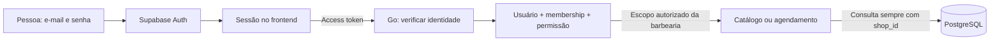

# Proposta de autenticação e acesso por barbearia

Status: **proposta para discussão, não implementada no backend**. Data: 22/09/2026.

A tela /login do frontend é uma demonstração. Ela não autentica, não cria sessão, não salva credenciais e não protege o painel. Este documento descreve a arquitetura recomendada para a implementação futura. Não foram criadas tabelas, migrations, endpoints ou dependências de autenticação.

## Recomendação

Começar com um único sistema e banco compartilhado entre barbearias, com isolamento por shop_id. Cadastrar as primeiras barbearias manualmente é viável, desde que o cadastro da empresa seja separado das contas das pessoas.

Usar **Supabase Auth para identidade, senha, recuperação e sessão** e **Go para autorização e regras do negócio**. Como o banco já está no Supabase, essa opção evita construir um sistema próprio de senhas e tokens. Ela também introduz dependência operacional do provedor: disponibilidade, configuração de e-mail, limites de uso e custos devem ser considerados antes de comercializar.

Não criar uma senha compartilhada por barbearia. Felipe pode ser proprietário de duas unidades e Rafael pode trabalhar em uma delas. Cada um faz login com seu próprio e-mail; o vínculo com cada barbearia define as permissões. Isso permite revogar um funcionário sem afetar o proprietário e identificar quem realizou uma alteração.

| Opção | Quando faz sentido | Avaliação para este projeto |
| --- | --- | --- |
| Supabase Auth + autorização em Go | Entregar login com um provedor já presente no projeto | Recomendada |
| Autenticação própria em Go | Requisito específico de controle ou estudo aprofundado de identidade | Mais trabalho: hashes, sessões, revogação, recuperação, proteção contra abuso e operação |
| Outro provedor gerenciado | Recursos comerciais ou integração que o Supabase não ofereça | Possível, sem necessidade concreta agora |
| Uma credencial compartilhada por barbearia | Protótipo descartável | Inadequada para funcionários, auditoria e múltiplas unidades |

[Supabase Auth](https://supabase.com/docs/guides/auth) fornece os mecanismos de autenticação. A autorização específica do sistema continua sendo nossa responsabilidade.

## Conceitos e dados propostos

| Entidade | Dono | Campos essenciais |
| --- | --- | --- |
| shops, já existente | shops | id, name, slug único, timezone IANA, active |
| users, proposta | identity | id local UUID, auth_issuer, auth_subject, display_name, active |
| shop_memberships, proposta | identity | shop_id, user_id, role, active, created_at |
| Registro de provisionamento, quando automatizado | caso de uso administrativo | chave idempotente, andamento, identidades/IDs relacionados, erro sanitizado |

A identidade externa é reconhecida pelo par issuer + subject, com unicidade. O subject vem de um token verificado, nunca de um campo enviado pelo formulário. E-mail é contato/login gerenciado pelo provedor; não deve ser a chave estável de autorização. Se houver cópia local para exibição, ela não substitui a identidade verificada.

shop_memberships tem unicidade em (shop_id, user_id) e referências a shops/users. Serviços, agendamentos e outros dados de negócio permanecem vinculados à barbearia. Restrições compostas devem impedir associações entre registros de tenants diferentes nas futuras tabelas relacionadas.

**Não adicionar password ou password_hash a shops/users.** Com Supabase Auth, as credenciais são responsabilidade do provedor. Não inserir senhas diretamente em auth.users nem criar manualmente hashes desse schema.

Um profissional do catálogo não é necessariamente usuário do painel. Um cliente que agenda também não é uma conta administrativa. Essas relações só devem ser criadas quando necessárias.

## Papéis iniciais

Dois papéis bastam para o primeiro incremento; não precisamos de um editor genérico de permissões.

| Ação | owner | staff |
| --- | --- | --- |
| Ver agenda e serviços da unidade | Sim | Sim |
| Criar/editar/cancelar agendamento | Sim | Sim |
| Gerenciar catálogo | Sim | Não inicialmente |
| Convidar/remover equipe | Sim | Não |
| Alterar dados da barbearia | Sim | Não |

Essa matriz é uma proposta de produto. Se funcionários só puderem gerenciar seus próprios atendimentos, isso exige uma regra adicional de vínculo com profissional, além do papel.

Impedir remoção/rebaixamento do último proprietário ativo da unidade. Revogação de membership afeta somente aquela unidade. Desativar usuário afeta suas unidades; desativar shop afeta todos os acessos à unidade.

Você, como operador do SaaS, não é automaticamente owner de todas as barbearias. Começar com provisionamento administrativo restrito, fora do painel dos clientes. Um futuro painel da plataforma terá permissões e auditoria próprias. Evitar um superadmin universal no frontend.

## Criação das primeiras contas

1. Você recebe os dados da barbearia e o e-mail do proprietário. Pode inserir os dados de negócio por SQL controlado no início.
2. Cria/convida a identidade pela área administrativa ou API administrativa do Supabase Auth. O proprietário define sua senha pelo fluxo do provedor; você não precisa conhecer essa senha.
3. Obtém o identificador verificado dessa identidade e grava a barbearia e seu primeiro membership de owner em uma transação local. Se o usuário local já existe, reutiliza-o.
4. O proprietário conclui o convite/verificação e faz login. Só usuários elegíveis e memberships ativos recebem acesso.
5. Um fluxo posterior permite que o owner convide funcionários para a sua unidade.

As operações externas no Auth e a transação PostgreSQL não são uma única transação distribuída. Se o convite ocorrer e a escrita local falhar, o usuário pode existir no Auth **sem acesso a nenhuma barbearia**. Registrar o andamento e repetir o passo local de forma idempotente, sem duplicar usuário/shop/membership. Nunca conceder acesso por e-mail informado pelo cliente como fallback.

No começo essa recuperação pode ser operacional, com procedimento documentado. Quando houver um comando de provisionamento, ele deve tratar usuário já existente, slug duplicado e falhas parciais explicitamente. Não chamar APIs externas dentro de uma transação longa de banco.

O cadastro público deve ser desabilitado na configuração do provedor durante a fase de convites. Esconder um botão no frontend não desabilita o cadastro. Mesmo uma identidade válida sem membership não tem acesso ao painel. Consulte [configuração do Auth](https://supabase.com/docs/guides/auth/general-configuration) e [API administrativa](https://supabase.com/docs/reference/javascript/auth-admin-createuser). Chaves administrativas ficam somente no ambiente do servidor/operador, nunca em NEXT_PUBLIC_*.

## Fluxo de login e seleção da unidade

1. A pessoa informa e-mail e senha no frontend.
2. O Supabase Auth verifica as credenciais e gerencia a sessão.
3. O frontend envia o access token na chamada à API Go.
4. O backend verifica o token e identifica o usuário local.
5. A API consulta os memberships ativos. Uma unidade: abre automaticamente. Várias: apresenta seleção. Nenhuma: informa ausência de acesso.
6. Em cada operação, o backend verifica novamente usuário, barbearia, membership e permissão.

O slug é um endereço público amigável, por exemplo /b/palma. Não é senha nem prova de autorização. A seleção de uma unidade no frontend é apenas uma solicitação; o backend só aceita a unidade se o usuário tiver o vínculo necessário.

O login pode ser central, sem pedir slug. Se futuramente houver uma página de login com marca por slug, ela poderá personalizar a aparência a partir de dados públicos, mas isso não muda a autorização.

## Sessão e segurança da API

Proposta para a primeira integração: seguir o cliente oficial para Next.js com cookies de sessão/renovação e enviar access tokens como Bearer para a API Go. O login não escreverá um booleano isLoggedIn ou credenciais em localStorage. Cookies do fluxo SSR padrão não devem ser presumidos HttpOnly: a integração pode precisar compartilhá-los com o cliente do navegador. Se houver requisito de manter todos os tokens inacessíveis ao JavaScript, avaliar um BFF separado antes de implementar, sem misturar os dois modelos.

A renderização do Next e seus redirecionamentos melhoram a experiência; não protegem a API. Usar o mecanismo de verificação recomendado pelo SDK para decisões no servidor, sem confiar apenas no conteúdo local da sessão. A [documentação SSR](https://supabase.com/docs/guides/auth/server-side/creating-a-client) é a referência para criação do cliente, renovação e cookies. Respostas autenticadas não devem ser compartilhadas por cache público.

No Go, validar assinatura, algoritmo permitido, issuer configurado, audience esperada, expiração e subject. Usar chaves públicas do endpoint JWKS configurado do projeto, com cache/rotação e timeouts; não buscar URLs arbitrárias indicadas pelo token. Preferir chaves assimétricas no projeto. Decodificar JWT sem verificar assinatura não autentica.

Não confundir role=authenticated do Supabase com owner/staff da aplicação. Não conceder permissões a partir de metadados que o próprio usuário possa editar. Inicialmente consultar os vínculos atuais no banco a cada operação administrativa facilita revogação imediata do acesso de negócio.

Logout encerra/renova o estado de sessão conforme o provedor, mas um access token já emitido pode continuar válido até expirar. Expiração, renovação, logout e bloqueio do usuário precisam de testes separados. Definir duração da sessão na implementação.

Produção: HTTPS, origens CORS explícitas, erros de credenciais genéricos, limitação de tentativas, proteção dos fluxos de recuperação e redirects permitidos. Operações autenticadas por cookies no Next exigem proteção contra CSRF/origem. O Go proposto usa Bearer explícito e não deve aceitar implicitamente qualquer cookie como sessão. Não registrar senhas, tokens ou corpos de login.

Fonte: [JWTs e validação no Supabase](https://supabase.com/docs/guides/auth/jwts).

## Isolamento no PostgreSQL

A aplicação usa pgx com conexão PostgreSQL direta. O token do Supabase enviado ao Go **não configura automaticamente auth.uid() nem aplica políticas RLS para aquele usuário nessa conexão**. Papéis privilegiados podem ainda ignorar RLS.

Cada repositório precisa receber o tenant já autorizado e filtrar leitura/escrita por ele. Não aceitar um shop_id arbitrário do corpo para autorizar. Manter FKs/constraints e testes de isolamento como parte do contrato.

Tabelas expostas pela Data API do Supabase precisam de políticas e grants apropriados, mesmo quando nossa aplicação usa Go. Para este desenho, preferir que o navegador acesse dados de negócio somente pela API Go. RLS pode ser defesa adicional com um desenho explícito de papéis/claims/transações; não habilitá-la e presumir que substitui os checks do backend.

Referência: [RLS do Supabase](https://supabase.com/docs/guides/database/postgres/row-level-security).

## Pacotes e responsabilidades propostos

| Local | Responsabilidade futura |
| --- | --- |
| identity/domain | User, Membership, Role, permissões e invariantes |
| identity/application | ResolveStaffIdentity, ListMyShops, AuthorizeShopAction, GrantMembership, RevokeMembership |
| identity/infra/postgres | Consultas de usuários e vínculos com sqlc, usando o pool compartilhado |
| identity/infra/http | Middleware que recebe o token e entrega identidade/escopo verificados; handlers de acesso |
| identity/infra/auth | Adaptador concreto de verificação do provedor, somente quando implementado |
| shops | Nome, slug, timezone e atividade da barbearia |
| cmd/api | Composição dos adaptadores, pool e rotas |
| Next.js | Formulários, sessão do provedor, seleção da barbearia e apresentação de erros |

O middleware verifica identidade; a aplicação autoriza a ação para a unidade. Casos de uso de catálogo/agendamento recebem um escopo confiável, sem importar SDK do Supabase. A criação do primeiro owner coordena shops e identity na mesma transação local.

Não criar agora diretórios vazios, interfaces genéricas ou um microsserviço de autenticação. RabbitMQ e worker não participam do login.

Bibliotecas a avaliar **na implementação**, sem instalação nesta proposta:
- Frontend: @supabase/supabase-js e o adaptador SSR oficial compatível com a versão então adotada.
- Go: net/http, Chi, context, pgx e sqlc já existentes; uma biblioteca de JWT/JWKS, por exemplo [lestrrat-go/jwx/v3](https://pkg.go.dev/github.com/lestrrat-go/jwx/v3/jwt), para validação criptográfica e chaves. Verificar e fixar versão quando escolhida.
- Nenhuma biblioteca própria de hash de senha será necessária com Auth gerenciado.

## Primeira fatia a implementar

1. Configurar o provedor: login por e-mail, convite, verificação, recuperação, URLs permitidas e política de sessão.
2. Criar novas migrations para users/memberships; preservar as migrations já aplicadas.
3. Implementar verificação de token, resolução de identidade e autorização por tenant no Go.
4. Propor GET /api/v1/me e GET /api/v1/me/shops para o frontend. Essas rotas ainda não existem e não foram adicionadas ao OpenAPI executável.
5. Substituir DEV_SHOP_SLUG nas rotas administrativas pelo escopo de membership verificado. O modo local atual não pode servir de bypass na publicação.
6. Integrar login, recuperação, aceite de convite, logout, renovação e seleção de unidade no frontend.
7. Validar isolamento e papéis antes de habilitar acesso de clientes reais.

Testes essenciais: token ausente/expirado/assinatura ou issuer incorretos; usuário sem membership; troca maliciosa de shop_id/slug; owner vs staff; revogação; último owner; dados de outra unidade em listas e por ID; usuário com duas unidades; convite repetido; falha parcial de provisionamento; sessão expirada; recuperação sem revelar existência de conta. Isolamento SQL e constraints precisam de PostgreSQL real.

Para convites e recuperação de clientes reais, configurar SMTP próprio/serviço de envio: o SMTP padrão do Supabase tem restrições e não é destinado à produção. Nenhum fornecedor foi escolhido ou contratado. Consulte [SMTP do Supabase](https://supabase.com/docs/guides/auth/auth-smtp).

## Decisões de produto ainda abertas

- Funcionário poderá alterar catálogo ou apenas agenda?
- Funcionário verá todos os atendimentos ou só os próprios?
- Uma pessoa poderá administrar várias unidades desde o primeiro lançamento? A modelagem proposta suporta isso.
- A marca de cada barbearia será personalizada? Palma continua sendo apenas a identidade da demonstração.
- Quando entrarão faturamento, suspensão por assinatura e painel do operador? Autenticação não substitui essas regras comerciais.

