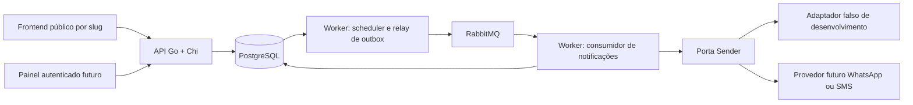

# Arquitetura do Barber-chat

Pesquisa e decisão: 17/09/2026 (UTC; sessão iniciada em 16/09 em São Paulo). Este documento separa a fundação executável do desenho dos próximos incrementos. Os links são fontes oficiais consultadas; as escolhas e os trade-offs são avaliações para este produto.

Atualização de 22/09/2026: catálogo agora implementa criar serviços em modo local explícito e listar ativos por slug. Shops implementa lookup de slug ativo. O [ADR 0007](adr/0007-catalog-services-and-local-tenant.md) registra as portas, moeda BRL e limite entre identificação de tenant e autorização. Os doc.go de catalog e shops/infra/postgres documentam o código atual; os demais fluxos de negócio abaixo permanecem alvo futuro.

## Contexto e requisitos

SaaS de agendamentos, inicialmente para uma barbearia e um profissional, preparado conceitualmente para múltiplas barbearias, profissionais e serviços. Um desenvolvedor deseja aprender Go, um framework HTTP (Chi escolhido pelo usuário), SQL, filas e workers. O MVP tem baixo volume. Não existe portfólio: serviços realizados são agendamentos concluídos usados em relatórios.

O link público usa slug da barbearia. Um formulário progressivo em formato de chat coleta nome, sobrenome e telefone; apresenta serviços, data e horários por profissional; permite revisar e confirmar; mostra os dados da reserva e solicita envio assíncrono. Cliente não possui conta. Dados incompletos permanecem no frontend e só são persistidos na confirmação. O frontend provável é Next.js, separado, ainda sem implementação.

O painel futuro autentica proprietário e funcionários autorizados. Gerencia barbearia, profissionais, catálogo de serviços, vínculo profissional/serviço, preço, duração, expediente, intervalos, folgas, bloqueios, clientes e estados dos agendamentos. Relatórios incluem realizados, cancelados, ausências, receita por período/serviço/profissional. Não há módulo de galeria.

Requisitos não funcionais: integridade concorrente, isolamento por tenant, tolerância a falhas de mensageria, jobs duráveis, idempotência, horários corretos, proteção de dados pessoais, operação simples, testes reproduzíveis no Windows e código Go legível. Sem promessa de SLA nesta fase. Meta inicial sugerida: confirmação HTTP sem esperar pelo provedor e lembretes processados em até um minuto do horário programado; medir antes de estabelecer objetivos de produção.

## Recomendação e alternativas de organização

Uma aplicação modular em um módulo Go, API e worker como executáveis separados, PostgreSQL compartilhado, RabbitMQ e frontend independente. Combinar módulos de negócio, pequenas camadas internas e ports/adapters quando existir uma fronteira concreta. É uma Clean Architecture pragmática; não aplicar a estrutura completa de um livro a cada entidade.

| Alternativa | Benefícios e custos | Decisão |
| --- | --- | --- |
| API e worker no mesmo módulo, binários diferentes | Compartilha tipos, casos de uso, testes e versão; exige disciplina nos imports | Adotar; runtime independente sem divisão prematura |
| Módulos Go separados no monorepo | Dependências/versões próprias; exige contratos, go.work e estratégia para código compartilhado | Adiar até precisar de versões realmente independentes |
| Repositórios separados | Autonomia de acesso/release; refatoração coordenada e integração custam mais | Rejeitar agora para um desenvolvedor |
| Camadas globais (`handlers/services/repositories`) | Fácil no começo; mudanças de uma funcionalidade se espalham pelo projeto | Usar camadas pequenas dentro do módulo, não como principal organização futura |
| Módulos por negócio | Coesão e ownership claros; risco de ciclos se limites forem vagos | Direção de evolução, sem criar módulos vazios |
| Clean Architecture estrita | Fronteiras explícitas; muitos DTOs, interfaces e mapeamentos | Complexidade sem retorno neste MVP |
| Clean Architecture pragmática | Regras independentes de HTTP e providers; abstração só onde é útil | Adotar |
| Módulos + camadas + ports/adapters | Organização por capacidade com substituição de infraestrutura nas bordas | Combinação recomendada |
| Microsserviços independentes | Escala/ownership isolados; consistência distribuída e operação maiores | Rejeitar agora; um worker não implica microsserviço |

Reavaliar extração quando houver equipe autônoma, contrato estabilizado, release independente frequente, necessidade de isolamento regulatório/operacional ou perfil de carga comprovadamente diferente. Escalar réplicas de API/worker ou separar scheduler e consumidor em processos vem antes de separar serviços/dados. Um backend único não obriga deploy conjunto dos dois binários.



Diagrama do alvo, não do código completo entregue. Hoje a API oferece health/readiness e criação/listagem de serviços; o worker testa conexões e seu ciclo de vida. Scheduler, relay, filas de negócio e adaptadores de envio ainda não existem.

## Limites e diretórios

`cmd` faz composição e gerencia sinais/recursos. `internal/httpapi` conhece HTTP e traduzirá DTOs/erros para casos de uso. `internal/worker` conhece o ciclo de execução; no futuro delegará jobs às mesmas capacidades de negócio. `internal/platform` contém conexões PostgreSQL/RabbitMQ, sem regras de agendamento. Domínio não importará Chi, AMQP, pgx ou SDK do provedor. Interfaces pequenas serão definidas por quem as consome, apenas quando houver uso; evitar repository genérico e pacotes `utils`.

```text
cmd/api/main.go                 composição da API
cmd/worker/main.go              composição do worker
internal/config/                ambiente validado e testes
internal/httpapi/               Chi, health/readiness e encerramento HTTP
internal/platform/postgres/     pool pgx em UTC
internal/platform/rabbitmq/     conexão AMQP com timeout e heartbeat
internal/worker/                ciclo de vida e testes
db/migrations/                 SQL Goose e orientação operacional
tests/integration/             conexões reais, publish/confirm/ACK
scripts/Load-Env.ps1            importação segura de KEY=VALUE no PowerShell
internal/modules/shops/        identidade da barbearia, slug e timezone
internal/modules/catalog/      profissionais, serviços e suas associações
internal/modules/customers/    contato e consentimento dos clientes
internal/modules/booking/      agenda, disponibilidade e agendamentos
internal/modules/notifications/ intenções, lembretes e resultados de envio
internal/modules/identity/     usuários administrativos e permissões
internal/modules/reporting/    consultas e relatórios sobre agendamentos
docs/                          arquitetura, ADRs, contrato e OpenAPI
```

Os módulos usam domain/doc.go para invariantes, application/doc.go para casos de uso e infra/doc.go para adaptadores e fluxo. Catálogo possui implementações concretas em infra/http e infra/postgres, com doc.go próprios; shops/infra/postgres resolve slugs. `modules` continua sendo um agrupamento de capacidades, com um único go.mod na raiz. Os limites são consultáveis com `go doc`.

A raiz de cada módulo é um diretório organizador. `domain` contém tipos e regras de negócio; `application` contém casos de uso em arquivos por ação; `infra` contém adaptadores concretos quando existe uma implementação que os utiliza. No catálogo, CreateService e ListServices recebem ServiceRepository e ShopResolver; o resolver é implementado em shops/infra/postgres. Não foram criados handlers falsos nem métodos que retornam “não implementado”. Em reporting, domain poderá conter conceitos de período/moeda/regras de relatório, sem exigir agregados artificiais.

O código reutilizável de conexão continua em `internal/platform`: abre pools/conexões, mas não conhece tabelas/regras de agendamento. `booking/infra` receberá esses recursos para implementar SQL e mapeamentos específicos de booking. `internal/httpapi` continua montando o servidor global; futuros handlers dos módulos serão registrados ali pela composição em cmd. Não abrir um pool por módulo nem importar um adapter de outro módulo para burlar seu contrato.

Os novos limites tornam explícitas duas responsabilidades antes agrupadas genericamente: `shops` é dono de slug/timezone/configuração da barbearia; `customers` é dono do contato/consentimento. Expediente, intervalos, folgas e bloqueios ficam em `booking`, inclusive padrões da barbearia, para que todas as escritas da agenda sigam o mesmo protocolo de concorrência. `catalog` é dono dos profissionais/serviços; funcionários autenticados e memberships pertencem a `identity`. Relatórios não criam um segundo cadastro de serviços realizados.

Direção de imports planejada: `cmd -> adaptadores -> application -> domínio do próprio módulo`. A camada application define as portas de que precisa; adaptadores concretos as implementam. Domínios não importam outros módulos ou infraestrutura. Coordenação entre módulos ocorre por portas pequenas e composição explícita, sem acesso irrestrito às tabelas alheias. Consultas de reporting podem usar joins revisados e somente leitura. A linguagem impede ciclos de imports, mas não faz cumprir sozinha todos esses limites; `internal` protege o projeto contra imports externos, não cada módulo de negócio contra seus vizinhos.

Criar agendamento exige uma transação que atravesse a resolução do cliente e as intenções de notificação: os adaptadores dessas portas compartilharão o mesmo contexto transacional concreto. Não chamar casos de uso que fazem commits independentes em sequência. O contrato transacional será definido ao implementar esse fluxo; não há UnitOfWork genérico vazio nesta entrega. Webhooks de respostas solicitam confirmação/cancelamento pela capacidade de booking, sem notifications alterar diretamente suas tabelas.

Frontend poderá entrar em `web/` com ferramentas Node próprias. O [ADR 0004](adr/0004-business-modules.md) registra os limites de negócio; o [ADR 0005](adr/0005-explicit-module-layers.md) define as camadas explícitas atuais. A organização se apoia nas [convenções oficiais de pacotes e comandos Go](https://go.dev/doc/modules/layout); as fronteiras de negócio são decisões específicas deste produto.

## Tecnologia e versões verificadas

As versões abaixo foram consultadas nas páginas oficiais e, para projetos Go, nas releases da API oficial do GitHub. Fixar versões usadas em `go.mod`, `go.sum` e Compose; atualizar com revisão e validação. A data de pesquisa não garante ausência de correções posteriores. Dependências transitivas ficam no `go.sum`.

| Tecnologia | Versão observada / escolha | Problema resolvido e fonte |
| --- | --- | --- |
| Go | 1.27.1 estável; selecionado | Toolchain e biblioteca padrão; [releases oficiais](https://go.dev/dl/?mode=json) |
| Chi | v5.3.2; selecionado a pedido do usuário | Rotas e middlewares, handlers compatíveis com net/http; [projeto](https://github.com/go-chi/chi), [release](https://github.com/go-chi/chi/releases/tag/v5.3.2) |
| PostgreSQL | 18.6, série suportada; selecionado | Transações, integridade relacional, ranges e jobs persistidos; [suporte](https://www.postgresql.org/support/versioning/) |
| pgx | v5.11.0; selecionado | Driver PostgreSQL, pool, transações e tipos nativos; [projeto](https://github.com/jackc/pgx), [release](https://github.com/jackc/pgx/releases/tag/v5.11.0) |
| RabbitMQ | 4.3.5; selecionado | Broker para estudo e entrega desacoplada; [releases/suporte](https://www.rabbitmq.com/release-information) |
| amqp091-go | v1.15.0; selecionado | Cliente mantido pela equipe RabbitMQ; [projeto](https://github.com/rabbitmq/amqp091-go), [release](https://github.com/rabbitmq/amqp091-go/releases/tag/v1.15.0) |
| Goose | v3.28.0; CLI externa fixada | Migrations SQL explícitas e versionadas; [comandos](https://pressly.github.io/goose/documentation/cli-commands/), [release](https://github.com/pressly/goose/releases/tag/v3.28.0) |
| Docker Compose | v2.31.0 disponível localmente | PostgreSQL/RabbitMQ locais com volumes/healthchecks; [referência](https://docs.docker.com/reference/compose-file/services/). Não afirmamos ser a versão mais recente |

Configuração usa `os.LookupEnv` com fallback para o `.env` opcional do diretório de execução, lido por `godotenv` v1.5.1. API e worker compartilham `config.Load()`, sem modificar o ambiente do processo. O [ADR 0006](adr/0006-automatic-dotenv.md) registra a necessidade, precedência e tratamento de erros. Goose é ferramenta externa, não dependência dos binários. `slog` gera JSON, `context` propaga cancelamento e `testing`/`httptest` testam. O Compose lê `.env`; o script PowerShell continua disponível para ferramentas externas e não interpreta código nem interpola variáveis.

### HTTP e dados: opções avaliadas

| Opção | Avaliação |
| --- | --- |
| [net/http](https://pkg.go.dev/net/http) | Métodos e padrões de rota, servidor e shutdown são suficientes. Seria a menor base; Chi acrescenta o aprendizado de framework solicitado |
| [Gin v1.12.0](https://github.com/gin-gonic/gin/releases/tag/v1.12.0) | Framework popular com binding/middlewares; contexto próprio e mais convenções. Bom se produtividade integrada for prioritária; não necessário agora |
| [Echo v5.3.1](https://github.com/labstack/echo/releases/tag/v5.3.1) | Framework com binding/validação e convenções próprias; [guia oficial](https://echo.labstack.com/guide/quickstart/). Chi favorece aqui estudo de handlers padrão |
| Outros HTTP | Fiber/FastHTTP não acrescentam benefício demonstrado para este volume; não fazer escolha por benchmark sintético |
| database/sql | Abstração padrão útil para múltiplos bancos; aqui o produto usa recursos PostgreSQL e pgx nativo reduz adaptação. pgx também oferece driver compatível se necessário |
| [sqlc v1.31.1](https://github.com/sqlc-dev/sqlc/releases/tag/v1.31.1) | Gera Go tipado a partir de SQL e suporta pgx; [tutorial](https://docs.sqlc.dev/en/latest/tutorials/getting-started-postgresql.html). Adiado até primeiras queries relevantes, evitando geração sem consumidor |
| [GORM](https://gorm.io/docs/) | CRUD e associações rápidos, mas pode ocultar SQL e não elimina SQL específico para ranges/outbox. Não adicionar ORM nem AutoMigrate |
| [Ent](https://entgo.io/docs/getting-started/) | Schema e código gerados tipados; introduz geração/convenções adicionais. Sem vantagem inicial frente a SQL explícito |
| [Tern v2.4.3](https://github.com/jackc/tern/releases/tag/v2.4.3) | Alternativa enxuta focada em PostgreSQL, adequada. Goose escolhido pela CLI simples e formato SQL conhecido; não é superior em todos os cenários |
| [Atlas](https://atlasgo.io/getting-started/) | Inspeção/diff declarativo e gestão de schema úteis em escala; mais ferramenta/modelo operacional do que precisamos |
| golang-migrate | Alternativa madura de migrations; sem necessidade de manter duas ferramentas. Goose cobre esta etapa |

Versões não fixadas para tecnologias rejeitadas sem uso. Next.js, provedor de autenticação, provedor de mensagens e ferramentas opcionais terão versões/licenças reavaliadas quando forem introduzidos.

### Mensageria: comparação

| Opção | Operação e aprendizado | Retry, agendamento, falhas e crescimento |
| --- | --- | --- |
| RabbitMQ + PostgreSQL | Broker adicional, UI útil, expõe exchanges, filas, ACKs e confirms | Retry/DLQ explícitos; scheduler no banco; exige outbox e deduplicação; escala consumidores |
| [River v0.47.0](https://github.com/riverqueue/river/releases/tag/v0.47.0) / PostgreSQL | Melhor alternativa para reduzir operação; jobs na transação do banco | [Jobs persistidos, retries e agendamento](https://riverqueue.com/docs); jobs descartados exigem inspeção/reexecução. Concorrência disputa recursos com OLTP; não ensina AMQP |
| Fila SQL própria | Usa só PostgreSQL e ensina locks/leases | Exige construir retries, retenção, dead jobs e métricas. Viável no MVP, mas infraestrutura própria pode custar mais que River |
| [Asynq v0.26.0](https://github.com/hibiken/asynq/releases/tag/v0.26.0) / Redis | Outro serviço; API de jobs conveniente | [Retries, agendamento e tarefas arquivadas](https://github.com/hibiken/asynq); avaliar persistência/failover Redis; escrita dupla ainda requer outbox. Não acrescentar Redis apenas por hábito |
| [NATS JetStream](https://docs.nats.io/concepts/jetstream) | Bom pub/sub e streaming; consumidor persistente precisa ser configurado | ACK/redelivery e persistência; estratégia de jobs futuros/DLQ precisa de desenho. Core NATS sozinho é at-most-once e não atende lembretes duráveis |
| Kafka / fila gerenciada | Úteis com replay analítico massivo ou operação cloud delegada | Custo/modelo operacional sem justificativa no MVP; serviço gerenciado exigiria decisão de provedor e orçamento |

Todas as opções precisam tratar idempotência do efeito externo. O volume não exige RabbitMQ; a razão decisiva é educacional. Um broker local de um nó não fornece alta disponibilidade. Antes de produção, dimensionar, monitorar, definir backup/restore e custo; esta entrega não contrata infraestrutura.

## Modelo de dados planejado e isolamento

Toda entidade pertencente a uma barbearia terá `shop_id NOT NULL`. Slug público é único e resolve o tenant no servidor; nunca confiar em `shop_id` arbitrário do corpo ou header. Consultas administrativas derivam tenant da sessão/membership. Chaves únicas e FKs compostas `(shop_id, id)` impedem associação entre recursos de tenants distintos. Clientes são locais ao tenant; não compartilhar cadastro global apenas por telefone. Testes obrigatórios devem tentar ler/escrever usando IDs de outra barbearia. RLS pode ser defesa adicional quando acesso por tenant estiver consolidado, com papel sem BYPASSRLS e contexto transacional seguro no pool.

Serviço: nome, descrição, duração positiva em minutos, preço não negativo em centavos inteiros, moeda e ativo. Profissional-serviço vincula recursos do mesmo tenant e poderá fornecer preço/duração específicos se o produto exigir. Agendamento preserva snapshots de nome, preço, moeda e duração efetivos, além dos IDs de serviço/profissional/cliente. Não recalcular histórico a partir do catálogo mutável. Relatórios de realizados derivam de `completed`; receita de serviços concluídos não deve ser chamada de caixa recebido sem modelagem de pagamentos/descontos/estornos. Reavaliar snapshots do nome do profissional quando renomeação histórica importar.

Instantes em `timestamptz`, sessão PostgreSQL em UTC, API em RFC 3339; timezone IANA da barbearia inicialmente `America/Sao_Paulo`. `timestamptz` não preserva o nome do fuso: guardar esse nome separadamente. Expediente é horário civil e dia da semana no fuso da barbearia; folgas por data civil e bloqueios por intervalo. Converter para instantes para comparar, tratar horários inexistentes/ambíguos em mudanças de DST, e não hardcodar UTC-3.

Estados candidatos são suficientes: `scheduled` (reservado, aguardando confirmação adicional), `confirmed` (cliente confirmou), `cancelled`, `completed`, `no_show`. `scheduled -> confirmed/cancelled/completed/no_show`; `confirmed -> cancelled/completed/no_show`. `completed` e `no_show` só após início conforme regra administrativa; estados finais não reabrem automaticamente. Correções futuras exigem auditoria. Mensagem entregue não muda o estado para confirmed: isso depende de ação do cliente/operador. Reagendamento, quando existir, deve atualizar agenda e jobs atomicamente e incrementar versão.

## Concorrência e disponibilidade

A disponibilidade considera habilitação e atividade do serviço/profissional, duração efetiva, expediente, intervalos, folgas, bloqueios, reservas existentes e timezone. Listar horários é apenas uma previsão. Na criação, revalidar tudo em transação, criar/localizar cliente por chave normalizada no tenant, guardar consentimento/snapshots e gravar reserva e intenções de mensagem juntas.

Proteção final planejada no banco: `CHECK (ends_at > starts_at)` com ambos NOT NULL, e exclusão GiST por tenant/profissional e interseção de `tstzrange(starts_at, ends_at, '[)')`. Usar `btree_gist` para igualdade de UUID. O intervalo semiaberto permite atendimento adjacente. Uma proposta para a futura tabela é:

```sql
-- Design example only: appointments does not exist in this scaffold.
ALTER TABLE appointments ADD CONSTRAINT appointments_no_overlap
EXCLUDE USING gist (
  shop_id WITH =,
  professional_id WITH =,
  tstzrange(starts_at, ends_at, '[)') WITH &&
) WHERE (status IN ('scheduled', 'confirmed', 'completed', 'no_show'));
```

Preservar exclusão também em realizados/ausências impede reservas retroativas sobre um histórico ocupado; somente cancelados liberam o período. Estados devem ter CHECK. Tratar SQLSTATE `23P01` como HTTP 409, mesmo que a consulta anterior mostrasse livre. Não depender de um mutex de processo. A técnica é fundamentada em [ranges e exclusion constraints do PostgreSQL](https://www.postgresql.org/docs/current/rangetypes.html).

Uma constraint sobre agendamentos não impede sozinha corrida contra criação de bloqueio/folga em outra tabela. Operações de reservar, reagendar, alterar expediente e criar bloqueios devem serializar por profissional com lock transacional comum (ex.: `SELECT ... FOR UPDATE` no profissional), sempre adquirido antes de consultar disponibilidade. Revalidar sob o lock e manter o mesmo protocolo em todas as escritas; ordenação estável se envolver vários profissionais. Catálogo/associação também precisam de leitura consistente e revalidação ao confirmar. Alternativa futura: ledger único de ocupações para reservas e bloqueios. Testar concorrência real em PostgreSQL, com duas transações e barreira, antes de disponibilizar o endpoint.

## Transação, outbox e lembretes (alvo futuro)

1. API resolve tenant, valida/normaliza entrada e consentimentos. Reivindica `Idempotency-Key` com chave única por tenant/operação e hash do pedido, dentro da mesma transação.
2. Adquire lock da agenda, calcula dados no servidor e tenta inserir cliente/agendamento com constraints. Reuso de telefone não concede acesso ao histórico.
3. Na mesma transação, cria intenção de confirmação/outbox imediata e job persistido do lembrete se o consentimento permitir. Commit de tudo ou de nada. Não enviar ao provedor dentro dessa transação.
4. Responde 201 com os dados e envio pendente. Se perder a conexão após o commit, retry com a mesma chave recupera a resposta gravada.
5. Scheduler do worker seleciona jobs vencidos em lotes com `FOR UPDATE SKIP LOCKED`, transforma cada ocorrência em outbox na mesma transação e marca a ocorrência materializada. Chave única evita duplicação entre schedulers.
6. Relay reivindica outbox em transação curta, com lease e token de proprietário; publica fora do lock. Marca publicada somente após confirmação e verificação de roteamento. Lease expirado permite recuperação; updates com token evitam proprietário antigo sobrescrever resultado novo. Queda entre publish e marcação gera duplicata esperada.
7. Consumidor reivindica a intenção pelo ID lógico, carrega estado atual e consentimento, executa o envio e persiste resultado/tentativa; depois ACK. Jobs terminalmente concluídos retornam ACK sem repetir efeito.

“Um dia antes”: proposta é 24 horas antes do instante de início. Se criado com menos de 24h, enviar apenas confirmação, sem lembrete atrasado. Requisito alternativo de “mesmo horário no dia civil anterior” difere em fusos com DST; confirmar essa regra de produto antes de implementar. Persistir `due_at`, versão do agendamento, tipo/canal e chave lógica; não agendar exclusivamente com `time.After`, cron de máquina ou TTL longo no broker. Scheduler pode usar ticker curto somente para descobrir linhas vencidas, sem perder jobs após reinício. Mensagens vencidas além do horário da reserva são descartadas com motivo registrado.

Cancelamento transacional cancela jobs/intencões pendentes e incrementa a versão da reserva. O consumidor confere estado e versão imediatamente antes de enviar, inclusive se a mensagem já estiver no broker. Para garantir que cancelamento confirmado antes do envio sempre vença, consumidor e cancelamento deverão compartilhar lock por agendamento; a chamada ao provider usa timeout curto enquanto o lock é mantido. Isso aumenta duração da transação, mas simplifica o MVP. Não é possível recolher mensagem já aceita pelo provedor, que pode entregá-la depois; registrar essa limitação no produto e reduzir o timeout. Reagendamento invalida a versão anterior e cria novo job.

## Contrato operacional de mensageria

Envelope futuro versionado: `event_id`, `schema_version`, `shop_id`, `appointment_id`, `notification_id`, `attempt`, `occurred_at`, `trace_id`. Transportar IDs e carregar telefone/conteúdo do banco, evitando PII em filas/logs. Não depender do flag `redelivered` como mecanismo de deduplicação.

| Situação | Estratégia planejada |
| --- | --- |
| Imediata | Outbox disponível agora -> exchange durável `notifications` -> fila quorum durável `notifications.send`; mensagem persistente |
| Agendada | `due_at` no PostgreSQL -> scheduler -> outbox; sem plugin delayed-message |
| Publicação | Publisher confirms + `mandatory` e tratamento de returns. Confirm ACK sozinho não prova que houve roteamento; returned/unroutable nunca marca outbox como publicada |
| Consumo | ACK manual após resultado persistido; prefetch e concorrência limitados à capacidade do provider e do pool |
| Falha transitória no provider | Persistir tentativa e próximo `due_at` com backoff+jitter, sugerido 30s, 2min, 10min, 30min, 2h; respeitar Retry-After e validade da reserva; ACK apenas após persistir |
| Retry agendado | Criar ocorrência/outbox com ID novo por tentativa, mas preservar `notification_id` lógico e chave de idempotência do provider |
| Banco indisponível durante consumo | Parar novas entregas/fechar canal; entregas não confirmadas ficam disponíveis para redelivery. Evitar loop `Nack(requeue=true)` sem espera |
| Inválida/limite de tentativas | Registrar motivo sanitizado e estado terminal; DLQ para inspeção. Reprocessamento explícito preserva rastreabilidade e revalida reserva/consentimento |
| Queda do broker | Outbox permanece pendente; relay reconecta com backoff/jitter e recria/verifica topologia. API continua se PostgreSQL estiver disponível |
| Mensagem duplicada | Unicidade do job/intenção no banco e claim/lease com fencing; consumidor de tentativa antiga consulta estado antes de enviar |

Na topologia futura, configurar DLX/DLQ por policies revisáveis, com fila de origem quorum e dead-lettering `at-least-once` + overflow `reject-publish` conforme suporte do broker. Dead-letter padrão não deve ser assumido livre de perdas. Para erros de negócio, registrar estado terminal/outbox para auditoria antes do ACK; para envelope malformado, usar DLX confiável. Alertar sobre DLQ e filas paradas; não descartar automaticamente. [Confirms/ACKs](https://www.rabbitmq.com/docs/confirms), [DLX](https://www.rabbitmq.com/docs/dlx) e [quorum queues](https://www.rabbitmq.com/docs/quorum-queues) fundamentam o desenho. Recursos novos de atraso do RabbitMQ 4.3 não são necessários: lembretes no banco são consultáveis, canceláveis e portáveis.

Idempotência é multinível: pedido HTTP, ocorrência do scheduler, publicação da outbox, intenção de envio e callback do provider. Registrar cada tentativa com timestamps, classe de erro, próximo retry, identificador do provider e resultado `accepted/delivered/failed/unknown` quando aplicável. Timeout não prova que o provider rejeitou. Sem chave idempotente ou consulta de status no provider, a janela “enviou, caiu antes de gravar” pode duplicar o SMS/WhatsApp. Não declarar exactly-once: usar reconciliação ou revisão de resultados ambíguos. Um adaptador falso determinístico, com sucesso/falha/timeout, será o primeiro consumidor de uma pequena porta Sender; não criar a interface vazia antes do caso de uso.

## Operação, segurança e testes

Configuração validada por variáveis; erros não imprimem DSN/segredos. `.env.example` usa credenciais locais ilustrativas; `.env` e `.tools` estão ignorados. PostgreSQL e RabbitMQ escutam somente no loopback do host via Compose. TLS/AMQPS, secret manager, credenciais rotacionadas e papéis mínimos serão necessários fora do desenvolvimento. Usar volume `/var/lib/postgresql` para PostgreSQL 18, conforme [imagem oficial](https://hub.docker.com/_/postgres).

HTTP possui timeouts de leitura/escrita/idle e shutdown com deadline, drenando requisições antes de fechar pool. Ctrl+C/SIGTERM cancelam o ciclo do worker. O scaffold não consome mensagens de negócio, não faz retry/reconexão automática e sai com código não zero se perder dependências; reiniciar manualmente no desenvolvimento. Antes de consumo real, implementar cancelamento de consumer, espera limitada pelas entregas em andamento e fechamento do canal para devolver unacked. Publisher/consumer AMQP devem ter conexões/canais gerenciados adequadamente, sem concorrência indiscriminada no mesmo canal.

Logs de ciclo de vida em JSON com `service`; Chi oferece request IDs e recovery. Logs de acesso estruturados, correlação HTTP -> outbox -> consumer, métricas e tracing OpenTelemetry serão adicionados com casos reais. Métricas prioritárias: latência/erros HTTP, conflitos de reserva, idade da outbox, atraso dos jobs, retries/DLQ e latência/falhas do provider. Não registrar corpos, nomes, telefones ou tokens. Monitorar backups e testar restore, não apenas a presença de volumes.

Unitários usam `testing` e `httptest`: config inválida, segredo em erro, health independente, readiness indisponível, rotas/métodos, drain HTTP e cancelamento/falhas do worker. Integração opt-in com tag `integration` exige PostgreSQL/RabbitMQ reais, confere timezone/extensão e roundtrip AMQP com confirm/ACK. Ausência de env em integração falha em vez de pular silenciosamente. Testes futuros: corrida por horário, isolamento cross-tenant, replay idempotente, rollback/outbox, falha de broker, cancelamento antes de envio e timeout ambíguo do provider. Testcontainers pode automatizar isso quando Docker em CI justificar outra dependência.

Mínimo de qualidade: gofmt, go mod tidy, go vet, go test, build de cada binário, Compose config e migrations no banco. `go test -race` quando houver toolchain C compatível; preferir CI Linux. Avaliar golangci-lint/Staticcheck e govulncheck em CI com versões fixadas, sem instalar pacotes de lint só para satisfazer uma lista. Air é opcional para hot reload; `go run` basta nesta fase e explica melhor o ciclo build/run. OpenAPI descreve apenas endpoints existentes; proposta de negócio no [contrato](api-contract.md).

## Riscos, decisões de produto e próximos incrementos

Riscos: custo de dois sistemas persistentes, garantia de entrega externa limitada, cancelamento concorrente, PII em filas/logs, autorização incorreta por tenant, deriva de schema/contrato, horário civil e abstrações prematuras. O banco protege sobreposição, mas os testes devem provar o protocolo para bloqueios e alterações administrativas. Autenticação, limitação de requisições/abuso e tokens de ação precisam existir antes de expor agendamentos na internet.

Próximo incremento recomendado: uma fatia de agendamento com mínimo de barbearia/profissional/serviço, constraints e teste concorrente real, usando provider falso quando chegar ao envio. Depois: outbox/scheduler/consumer/retries, cancelamento e observabilidade; em seguida interface pública e autenticação/painel. Não implementar todas as tabelas administrativas antecipadamente.

Antes de funcionalidades correspondentes, confirmar: lembrete 24h versus dia civil anterior, política de cancelamento/no-show, profissional escolhido ou atribuído automaticamente, canal/provedor/custo e regras de consentimento. Não há mudança de repositório, microsserviços nem contratação de serviço nesta decisão. Produção e fornecedores continuam fora do escopo atual.
